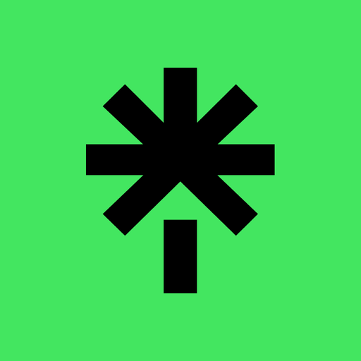

<!--Header-->
<h1>
     Hey! I'm Yurii
</h1>

Welcome to my profile!   Fullstack developer from <b>Lviv, Ukraine 🇺🇦 </b>!

<!--Tech stack-->
<h3>Things I code with</h3>
<!--Icons: https://simpleicons.org/-->

  
  
  
  
  
  
  
  
  
  
  
  
  
  
  
  
  
  
  
  
  
  
  
  
  
  

---

<!--About-->

<h2>👾  About Me</h2>
<ul>
  <li>👨‍💻 Currently working as Software Engineer at <a href="https://usoftware.co/">United Software Solutions</a></li>
  <li>🛠  Coding since 2014 with 5+ years of experience in enterprise wide software development</li>
  <li>💬 Ask me about anything related to <strong>JavaScript/Typescript, React, NodeJS</strong> etc</li>
  <li>💻 Love exploring new tech stack and building cool stuffs</li>
  <li>📲 Love for science and innovation</li>
  <li>🎮 Love VR, especially <a href="https://scoresaber.com/u/76561198106804666" target="blank">Beat Saber 🤺</a></li>
  <li>🐶 Love pets</li>
  <li>📙 Check out my <a href="CV/Yurii Khvyshchuk CV - Senior Full Stack JavaScript Engineer.pdf">CV</a></li>
</ul>

<!--Detailed github stats-->

|  |  |
| ------------------------------------------------------------------------------------------------------------------------------------------------------------------------------------------------------------------------------------------------------------ | ----------------------------------------------------------------------------------------------------------------------------------------------------------------------------------------------------------------- |

<!-- --- -->

<!--Pinned repos-->
<h4>Pinned</h4>

<!--Snake-->

	

 

🔗 &nbsp;**Connect with me**

<!--Footer-->

